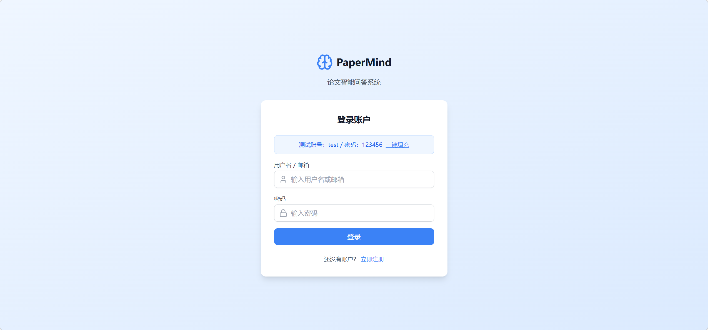
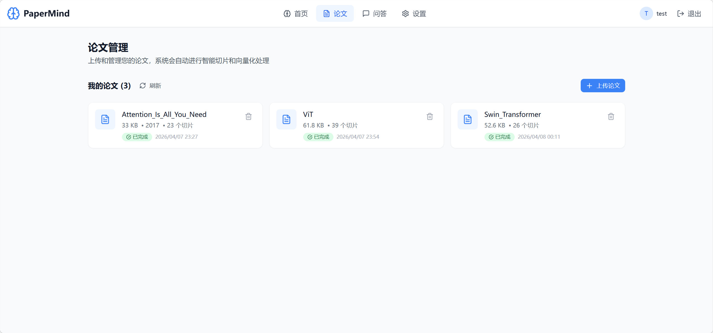
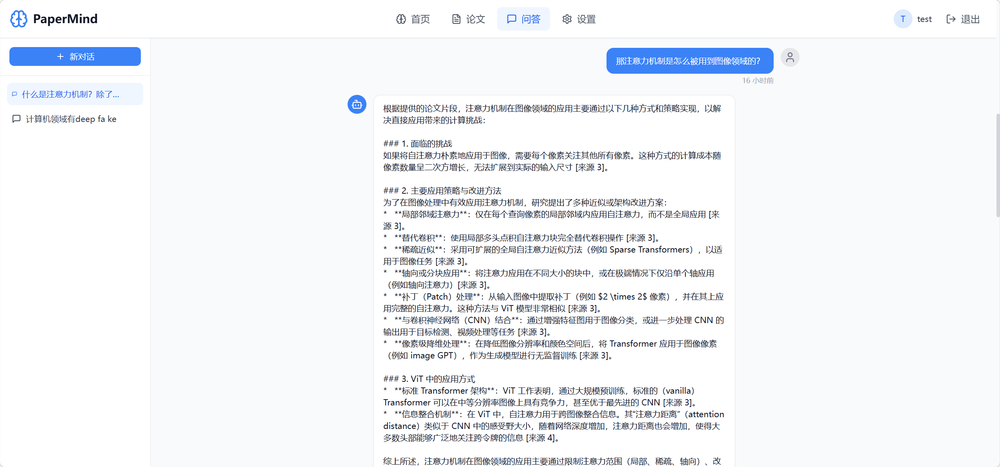
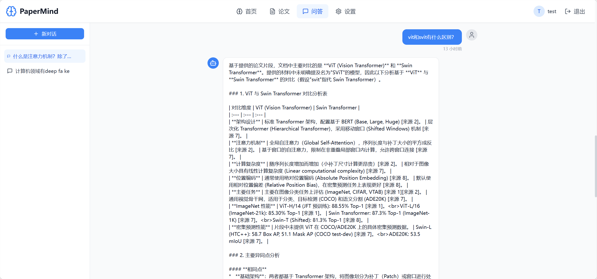

# PaperMind

> 一套面向科研场景的论文知识检索与问答系统。上传论文，跨篇章问答，跨论文对比。

🔗 **在线体验**：https://wolfden.website/paper_mind/login （登录页提供测试账号，无需注册）

📦 **技术栈**：Go + Gin + GORM + PostgreSQL (pgvector) + Redis + React + Docker

---

## 项目简介

PaperMind 是我在硕士研究阶段为自己做的一个工具。

调研一个新方向时，我经常需要在十几篇论文之间反复跳转，对比它们的方法、实验设置和结果。手动翻 PDF 效率极低，而通用的 RAG 工具（比如 ChatPDF 类）又有两个问题：一是它们对论文的结构化排版处理得很糙，切片经常把方法描述和实验结果切散；二是它们大多只支持单篇问答，做不了"A 方法和 B 方法在数据集 X 上效果差多少"这种跨论文对比。

PaperMind 就是为了解决这两个问题做的。它针对论文 PDF 的章节结构做了专门的两级切片，并实现了"知识提取"和"跨论文对比"两种问答模式，配套不同的 Prompt 模板和检索策略。目前已经在 Attention Is All You Need、ViT、Swin Transformer 三篇论文上完成了跨论文对比的验证。

---

## 在线演示

> 
>
> 
>
> 
>
> 

线上版本部署在独立云服务器，已经预置了 Attention Is All You Need、ViT、Swin Transformer 三篇论文，登录后可以直接体验问答和对比功能。

---

## 系统架构

```
┌─────────────────────────────────────────────────────────────┐
│                        Client (React)                       │
│         论文管理 / 问答对话 / 跨论文对比 / 用户认证          │
└──────────────────────────┬──────────────────────────────────┘
                           │ HTTPS
┌──────────────────────────▼──────────────────────────────────┐
│              Nginx Proxy Manager (跨服务器反代)              │
└──────────────────────────┬──────────────────────────────────┘
                           │
┌──────────────────────────▼──────────────────────────────────┐
│                    Go Backend (Gin + GORM)                  │
│  ┌──────────┐ ┌──────────┐ ┌──────────┐ ┌──────────────┐    │
│  │   Auth   │ │  Paper   │ │   Chat   │ │   Pipeline   │    │
│  │ JWT+白名单 │ │ 上传/解析 │ │ 多轮问答  │ │ 切片/向量化   │    │
│  └────┬─────┘ └────┬─────┘ └────┬─────┘ └──────┬───────┘    │
└───────┼────────────┼────────────┼──────────────┼────────────┘
        │            │            │              │
   ┌────▼────┐  ┌────▼────────────▼─────┐  ┌────▼─────────┐
   │  Redis  │  │  PostgreSQL+pgvector  │  │   LLM API    │
   │ JWT白名单 │  │   papers / chunks    │  │  Embedding + │
   │         │  │   conversations       │  │  Chat 接口   │
   └─────────┘  └───────────────────────┘  └──────────────┘
```

---

## 核心设计与实现

### 1. 结构感知的两级切片

通用 RAG 项目对 PDF 的处理通常是"按固定 token 数硬切"，这种切法对普通文档可能够用，但对论文是灾难——一个 Method 章节经常会被切到一半，导致检索时召回的 chunk 缺乏上下文。

PaperMind 针对论文的结构化特征，做了**两级切片**：

- **第一级**：按章节切分。先解析 PDF 提取出 Abstract、Introduction、Method、Experiment、Conclusion 等章节边界，每个章节作为一个语义单元。
- **第二级**：对超长章节（如 Method）按 token 数细分，但保证不跨章节。切片参数：MaxChunkSize = 512 tokens，ChunkOverlap = 64 tokens。

每个 chunk 同时存储 `section_type` 字段（abstract / method / experiment 等），后续检索时可以按 section 过滤。

> 💡 **PDF 解析回退方案**：实际开发中发现 Go 生态的 PDF 解析库对复杂排版（双栏、表格、公式）的支持较差。为此 PaperMind 同时支持 **Markdown 上传通道**——用户可以直接上传 Markdown 格式的论文，由 `#` `##` 标题直接识别章节，准确率接近 100%。这是一个工程上的务实选择：与其在 PDF 解析上死磕，不如提供一条可靠的退路。

### 2. 混合检索 + 用户数据隔离

检索环节用了 **向量检索 + 结构化过滤** 的混合方案：

- **向量检索**：用 pgvector 的 `<=>` 操作符（cosine distance）做相似度检索，TopK 默认值：提取模式 5，对比模式 10
- **结构化过滤**：根据问题意图过滤 `section_type`（比如问"实验结果如何"时优先召回 `experiment` 类型的 chunk）
- **用户隔离**：在检索 SQL 层强制注入 `user_id` 过滤条件

最后这一点其实是我在自测中发现的安全漏洞——最初版本的检索 SQL 没有 user_id 过滤，理论上 A 用户的提问可能召回到 B 用户上传的论文 chunk。这是个很严重的越权问题。修复后所有检索路径（包括追问接口）都强制注入 user_id。

```sql
-- 修复后的检索 SQL（简化版，实际使用 PostgreSQL $1/$2 占位符）
SELECT id, content, section_type, paper_id
FROM chunks c
JOIN papers p ON c.paper_id = p.id
WHERE p.user_id = $1           -- 强制用户隔离
  AND c.section_type IN ($2)   -- 意图过滤（可选）
  AND c.paper_id IN ($3)       -- 论文范围（可选）
ORDER BY c.embedding <=> $4    -- pgvector cosine 距离
LIMIT $5;
```

### 3. 双模式问答：知识提取 vs 跨论文对比

PaperMind 实现了两种问答模式，分别有独立的 Prompt 模板和检索策略：

- **知识提取模式**：针对单篇论文的方法 / 实验细节查询。检索范围限定在用户指定的单篇论文内，Prompt 要求 LLM 基于检索到的 chunk 回答并给出引用位置。
- **跨论文对比模式**：用户选定 2-3 篇论文，提一个对比类问题（如"这三篇在 Attention 机制上的差异是什么"），系统从每篇论文中并行召回相关 chunk，Prompt 模板要求 LLM 以**对比表格或对比段落**的形式输出。

> 

### 4. JWT + Redis 白名单的认证机制

标准的无状态 JWT 有一个问题：token 一旦签发，到过期为止无法主动作废，这意味着用户"登出"其实是个伪操作（前端只是删除了 token），如果 token 被泄露则完全无法补救。

PaperMind 在标准 JWT 的基础上引入了 **Redis 白名单**：

- 登录时，签发 JWT 的同时把 token 写入 Redis（key 是完整 token，value 是用户 ID）
- 每次请求验证 JWT 时，除了校验签名和过期时间，还要检查 Redis 中是否存在对应记录
- 主动登出 = 从 Redis 中删除对应记录（token 立即失效）
- 这样既保留了 JWT 的标准格式，又获得了"可主动失效"的能力

> 这一设计不在最初的方案里，是开发到一半发现"Redis 已经初始化了但其实没有用上任何业务"之后主动加的，顺便给项目补了一个真正用得上的 Redis 应用场景。

### 5. Goroutine 异步处理流水线

论文上传后的处理（PDF 解析 → 章节切片 → Embedding 向量化 → 入库）是个耗时操作，单篇论文可能需要十几秒到几十秒。如果同步等待，前端会卡死。

PaperMind 的上传接口立即返回，后台开 Goroutine 异步执行整个流水线：

```
[用户上传 PDF] → [HTTP 立即返回 paper_id] 
                                ↓
              [后台 Goroutine 异步流水线]
                                ↓
        PDF 解析 → 章节识别 → 切片 → Embedding → 入库
                                ↓
                      [更新 paper.status]
```

前端上传完成后立即返回，用户可手动刷新列表查看处理进度。`paper.status` 字段记录处理状态，可能的值包括：pending、extracting、parsing、chunking、embedding、completed、failed。

---

## 工程化与部署

- **容器化**：项目通过 docker-compose 编排，包含 Go 后端、PostgreSQL（pgvector 镜像）、Redis 三个服务
- **跨服务器部署**：后端部署在阿里云轻量服务器 B，但域名解析、SSL 证书、Nginx Proxy Manager 都在另一台服务器 A 上。流量路径是 `用户 → 服务器 A (NPM 反代 + HTTPS) → 服务器 B (Go 后端 :8080)`
- **HTTPS**：通过 Nginx Proxy Manager 自动签发 Let's Encrypt 证书

部署过程中独立排查并解决的几个问题：

- **SSH socket 按需启动故障**：服务器 A 的 SSH 在某次更新后变成按需启动，导致首次连接超时。最终通过分阶段诊断（检查 systemd unit → 检查 socket activation → 检查防火墙）定位并修复。
- **Go UTF-8 字符截断**：日志和数据库中部分中文字符出现乱码，根因是某段处理代码按字节截断字符串而不是按 rune。
- **Zustand hydration 无限循环**：前端使用 Zustand 持久化状态时遇到 SSR / hydration 不一致导致的循环渲染，通过延迟挂载解决。
- **Docker 镜像中转**：服务器拉取镜像时网络受限，通过本地构建 → 推送到中转仓库 → 服务器拉取的方式解决。

---

## 本地启动

### 环境要求
- Go 1.21+
- Docker & docker-compose
- 阿里云通义千问 API Key（用于 LLM 和 Embedding）
  - LLM 模型：qwen3.5-plus
  - Embedding 模型：qwen3-vl-embedding（1024 维向量）

### 启动步骤

```bash
# 1. 克隆仓库
git clone https://github.com/Wolf1024Hzx/PaperMind.git
cd PaperMind

# 2. 配置环境变量
cp .env.example .env
# 编辑 .env，填入：
#   - DB_* 数据库配置
#   - REDIS_* Redis 配置
#   - ALIYUN_API_KEY（通义千问 API Key）
#   - EMBEDDING_MODEL（默认 qwen3-vl-embedding）
#   - LLM_MODEL（默认 qwen3.5-plus）
#   - JWT_SECRET

# 3. 启动依赖服务
docker-compose up -d postgres redis

# 4. 启动后端
go run cmd/server/main.go

# 5. 启动前端
cd web
npm install
npm run dev
```

后端默认监听 `8080`，前端默认监听 `5173`。

---

## 项目结构

```
PaperMind/
├── cmd/server/              # 程序入口
├── internal/
│   ├── config/              # 配置加载
│   ├── app/                 # 应用初始化
│   ├── model/               # 数据模型（User/Paper/Chunk/Conversation/Message）
│   ├── dto/                 # 数据传输对象（请求/响应结构）
│   ├── repository/          # 数据访问层
│   │   ├── user_repo.go
│   │   ├── paper_repo.go
│   │   ├── chunk_repo.go
│   │   ├── conversation_repo.go
│   │   └── vector_repo.go   # 向量检索
│   ├── service/             # 业务逻辑层
│   │   ├── auth_service.go      # JWT + Redis 白名单
│   │   ├── paper_service.go     # 论文上传 + 异步处理流水线
│   │   ├── chat_service.go      # 对话与问答
│   │   ├── llm_service.go       # 通义千问 LLM API
│   │   ├── embedding_service.go # 通义千问 Embedding API
│   │   └── redis_service.go     # Redis 封装
│   ├── handler/             # HTTP 处理器
│   ├── middleware/          # JWT 认证中间件
│   └── pkg/                 # 公共工具包
│       ├── chunker/         # 两级切片实现
│       ├── extractor/       # PDF/Markdown 提取
│       ├── parser/          # 章节解析
│       ├── common/          # 共享类型（SectionType）
│       └── prompt/          # Prompt 模板
├── web/                     # React 前端
├── docker-compose.yml
└── README.md
```

---

## 后续优化方向

这是一个 MVP 版本，主要为了验证完整的 RAG Pipeline 在论文场景下的可行性。已经规划但未实现的优化方向：

- **SSE 流式输出**：当前 LLM 响应是一次性返回的，整体延迟接近 30 秒。后续会用 Server-Sent Events 实现流式输出，让用户逐字看到回答
- **限流**：使用 Redis ZSET 实现滑动窗口限流，对 Chat 接口按用户限制（如每分钟 10 次），因为 LLM 调用成本较高
- **热门问答缓存**：以 `hash(question + paper_ids)` 为 key 缓存高频问答，TTL 30 分钟，相同问题直接命中缓存
- **Re-rank**：在向量检索召回的 TopK chunk 之后加一个 Cross-Encoder Re-rank 阶段提升精度
- **PDF 解析升级**：引入 PyMuPDF 或商用 PDF 解析服务，提升对双栏 / 公式 / 表格的提取质量

---

## License

MIT

---

## About

这是一个个人项目，目的是为我自己的科研工作做一个真正用得上的工具，同时作为求职时展示工程能力的载体。

如果你也是研究生，欢迎试用线上版本：https://wolfden.website/paper_mind/login
